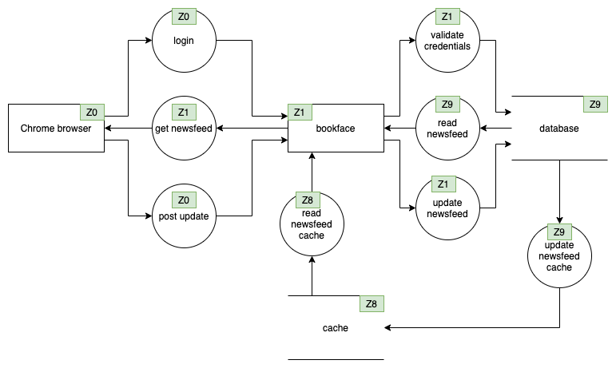
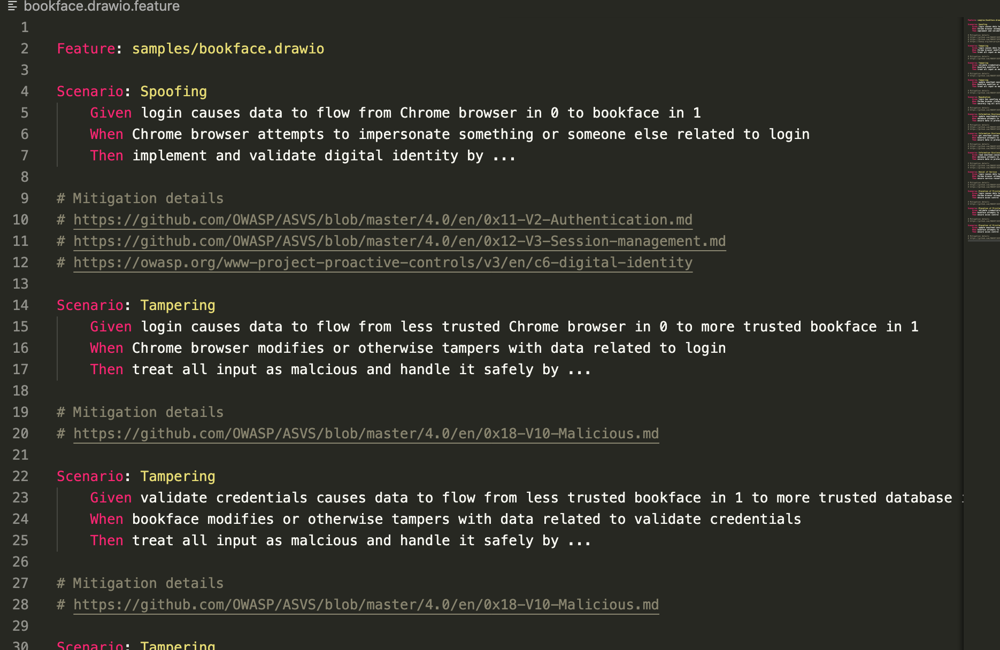

```
materialize threats.
                              '             .           .
                           o       '   o  .     '   . O
                        '   .   ' .   _____  '    .      .
                         .     .   .mMMMMMMMm.  '  o  '   .
                       '   .     .MMXXXXXXXXXMM.    .   ' 
                      .       . /XX77:::::::77XX\ .   .   .
                         o  .  ;X7:::''''''':::7X;   .  '
                        '    . |::'.:'        '::| .   .  .
                           .   ;:.:.            :;. o   .
                        '     . \'.:            /.    '   .
                           .     `.':.        .'.  '    .
                         '   . '  .`-._____.-'   .  . '  .
                          ' o   '  .   O   .   '  o    '
                           . ' .  ' . '  ' O   . '  '   '
                            . .   '    '  .  '   . '  '
                             . .'..' . ' ' . . '.  . '
                              `.':.'        ':'.'.'
                                `\\_  |     _//'
                                  \(  |\    )/
                                  //\ |_\  /\\
                                 (/ /\(" )/\ \)
                                  \/\ (  ) /\/
                                     |(  )|
                                     | \( \
                                     |  )  \
                                     |      \
                                     |       \
                                     |wizardsh`.__,_
                                     \_________.-'
It's magic.
```
# :confetti_ball: Who is this for?
Developers and security practitioners who want to perform 'graph' analysis on data flow diagrams - **using SQL**. 

`materialize-threats` ingests draw.io data flow diagrams into a database, represents them like a property graph, then uses SQL to answer questions about them. 

Today, we can answer questions like:

* What STRIDE based threat classes :warning: impact which elements and flows in my diagram? 
* What mitigations :lock: & test cases :white_check_mark: should be considered for this diagram? 

These are just a few ideas.

# :moneybag: What's in the box?
* materialize_threats python module
    * Parse [draw.io](https://github.com/jgraph/drawio-desktop/releases) data flow diagrams into graph representation (nodes, edges) stored in a RDBMS (sqlite in this demo)
    * SQL (ORM) implementation of [Rapid Threat Model Prototyping methodology](https://github.com/geoffrey-hill-tutamantic/rapid-threat-model-prototyping-docs) used to generate threat classes
* (Optional) Minimal Draw.io shape library (dfd-materialize.xml)
    * Tag trust zones more easily
* [Gherkin](https://cucumber.io/docs/gherkin/) + [STRIDE](https://en.wikipedia.org/wiki/STRIDE_(security)) test plan/feature file generator

# :wrench: How do I use it?
## Demo


## 1. Creating the diagram
* Use [draw.io](https://github.com/jgraph/drawio-desktop/releases) with the built-in threat modeling shape set, or use ours
* Create a data flow diagram using some guidelines
   * Use processes between entities to describe flows
      * Example: [Entity: Browser] --> (Process: Login) ----> [Entity: API]
   * Identify trust zones using the green 'security control label' following the [Rapid Threat Model Prototyping methodology](https://github.com/geoffrey-hill-tutamantic/rapid-threat-model-prototyping-docs) process
      * untrusted sources (entities) are 0
      * sinks (data store) are <=9
      * +1 or -1 in between
   * Processes inherit trust zones from the upstream entity
* Save it as a .drawio file in a convenient location

Some notes about how to make the diagram:
* You don't need to include a Trust Boundary - it won't get parsed and has no bearing on the threats which appear
* You don't need to include the STRIDE labels - we generate the threats for you!
* Bi-directional flows are currently not supported - flows move in one direction. In some cases, data might flow from Entity A to Entity B, while data also flows from Entity B to Entity A; model these as two separate flows and you'll be fine.
* Entities must talk to other entities through processes - the process is mandatory and must be included.

### Example


## 2. Enumerating threats
```
pip install materialize-threats
materialize-threats --diagram=/path/to/diagram.drawio
```

## 3. Creating the feature file
Materialize threats will create a Gherkin feature file with boilerplate scenarios and mitigations, along with remediation tips. By default, it uses the diagram filename.



# :mag_right: Sample data
```
materialize-threats
```

More samples can be found in the /samples directory
```
materialize-threats --diagram=samples/bookface.drawio
```

# :warning: Is this production ready?
Not yet.
* There are no tests written, but im pretty sure it works. 
* Lots of other python stuff that might horrify you but wont impact functionality that I know of.

# :computer: Development
```
git clone git@github.com:secmerc/materialize_threats.git
cd materialize_threats
python3 -m venv ./venv
source ./venv/bin/activate
pip install -e .
pytest
```

## Publishing
```bash
python3 -m pip install --user --upgrade setuptools wheel twine

python3 setup.py sdist bdist_wheel
python3 -m twine upload dist/*
```

# :link: Links
* https://docs.microsoft.com/en-us/archive/blogs/larryosterman/threat-modeling-again-presenting-the-playsound-threat-model
* https://github.com/geoffrey-hill-tutamantic/rapid-threat-model-prototyping-docs
